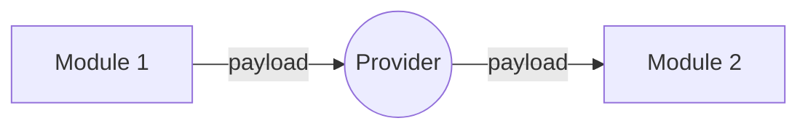
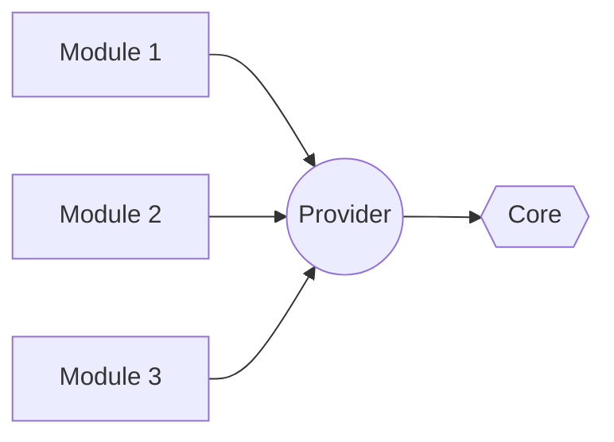

This readme comes with another languages :
- [English (EN)](README_EN.md)
- [Bahasa Indonesia (ID)](README.md)

# PREVIEW ONLY
Fitur utama masih dalam pengembangan dan testing seperti :
- Modification Safe

Follow project ini untuk mendapatkan update notifikasi.

# THANK YOU
Sebelumnya saya ingin mengucapkan terimakasih dan apresiasi untuk para kontributor yang sangat luar biasa [Kontributor](CREDITS.md).

 - **Joseph Sanjaya** (meet: [joseph](https://github.com/JosephSanjaya)). Original desing dari Konsep dan Terminologi Navigasi yang luarbiasa dalam codebase ini.
 
# FREE TO USE
Anda dapat menggunakan codebase ini sebagai basis proyek anda dan memodifikasinya sesuai kebutuhan proyek anda. Saya membuat codebase ini, dengan harapan codebase ini bisa membantu siapa saja untuk memulai proyek mereka, terutama proyek berskala besar. Saya berterimakasih kepada siapa saja yang menggunakan codebase ini sebagai basis proyek mereka, dikarenakan dengan menggunakan codebase ini, anda turut berkontribusi membantu saya dalam menguji codebase ini. Saya harap dengan lebih banyak orang yang menggunakan codebase ini, akan bisa memberikan input dan masukan atau saran untuk membantu saya mengambangkan codebase ini. Untuk membuat codebase ini menjadi lebih baik dan robust. Saya juga akan sangat merasa senang untuk menerima saran, ide, maupun kontribusi dari anda sekalian untuk proyek ini.

# Welcome to My Codebase Design!
Untuk mengukur sesuatu, kita memerlukan sebuah base line dan alat ukur, begitu juga untuk sebuah arsitektur software. Baseline tersebut adalah **Alur Dependensi** dan **Alur Kerja**, sementara alat ukurnya adalah Prinsib-prinsib pembuatan Software. Seberapa robust sebuath software dapat diukur dari seberapa banyak Prinsib-prinsib pembuatan Software yang diaplikasikan ke dalamnya. Selain dari pada itu adalah preferensi.

Disini kita akan "**Back to Basic**" dengan berfokus sepenuhnya pada **Alur Dependensi** dan **Alur Kerja**.

Saya memiliki prinsib sederhana; "Jika sulit berarti salah". Jadi kita akan membuatnya sedikit lebih mudah dengan menghadirkan sebuah module baru pada gradle project ,yaitu : **Provider** dan **Igniter**.

Ide utama dari proyek ini adalah:
1. Menghilangkan Horizontal dependency sepenuhnya, dengan memunculkan module baru yakni **Provider** dan **Igniter**.
2. Menghilangkan state dari data layer, dengan memaksimalkan functional pattern pada data layer.
3. Me-lokalisasi side effect. Kita harus membatasi module yang bisa melakukan side effect dan sebisa mungkin menghilangkannya.

# Project Arsitektur
Projek arsitektur mencakup keseluruhan arsitektur dari gradle project kita. Tidak segala hal bisa kita lakukan dengan gradle project akan tetapi **Pengecualian adalah hal yang buruk** jika kita tidak membatasinya. Jadi kita akan membatasi pengecualian tersebut hanya 2 hal.
1. App Module adalah bagian dari Igniter Module. Sehingga dia berperilaku seperti halnya Igniter Module. Igniter akan menginjeksikan module-module kedalam Application class, sementara App module mendeklarasikan Intent kedalam manifest.
2. Straight dependensi ke Core Module. Karena komponen Core Module sangat banyak dan kecil-kecil, akan terlalu sulit untuk menerapkan dependensi injection padanya. Oleh karena itu kita akan bergantung langsung pada Core Module akan tetapi tetap harus melalui Provider Module.

**Circular dependensi** terjadi dikarenakan kita mengizinkan "**Horizontal Dependency**". Jadi kita tidak akan mengijinkan adanya Horizontal dependensi dalam design architecture ini.
1. Sebuah module tidak boleh depend ke module lain kecuali Provider.
2. Sebuah module, tidak perlu mengetahui keberadaan Module Lain, selain keberadaan module Provider.

## Provider
Sebagai mana namanya, Provider bertugas untuk memprovide module berdasarkan kontrak module pada Provider. Sebagai contoh, module tersebut bisa sebuah **API**, **Aktivitas**, **Widget** dan lain sebagainya.

### Runtime Flow

Setiap module dapat berinteraksi dengan module lain melalui kontrak yang sudah dideklarasikan pada Provider Module. Tentu saja module tersebut sebelumnya harus diregistrasikan kedalam **Igniter Module**.

### Dependency Flow

Seluruh module (yang masuk dalam kategori runtime module) hanya depend ke 1 Module, yakni Provider Module. Sementara Provider Module depend ke **Core Module**. Dalam arsitektur ini **Core Module** adalah sebuah pengecualian, dikarenakan Core Module memiliki sangat banyak komponent dan kebanyakan berukuran sangat kecil. Oleh Karena itu, akan jauh lebih mudah jika semua module yang membutuhkan core **"Straight Depend" ke Core Module**, dan semua module tetap harus **mengakses Core Module melalui Provider**.

## Igniter
Sebagaimana namanya, Igniter adalah sebuah module yang bertugas untuk menjadi sumbu api. Igniter perlu depend ke semua module, mengikatnya bersama-sama dan meng-injeksikannya ke dalam Application Class.

**Application** perlu **diprovide oleh Igniter**. Dan Igniter perlu menghubungkan seluruh Module ke satu sumbu api dalam Application class.

## Overview arsitektur
Anda bisa melihat overview arsitektur pada file [arsitektur-overview.pdf](arsitektur-overview.pdf)

# Internal Module Arsitektur
Aplikasi front-end hanya terdiri dari 2 hal yakni **UI** dan **Data**.

## UI
UI adalah module level tinggi, penuh dengan side-effect, lifecycle, configuration changes dan lain sebagainya. Module ini memang cukup rumit, oleh karena itu, prinsib SOLID dan Dependency injection akan sangat membantu kita. Tidak ada hal yang istimewa yang perlu saya sampaikan, akan tetapi ada satu hal:

># THINK STATELESS

Buat segalanya stateless jika memungkinkan. Jangan membuat apapun yang memiliki internal state.

**Note**: Sekalipun UI penuh dengan side effect, kita tidak boleh hanya memakluminya. Melainkan kita harus sebisa mungkin menghilangkannya. Dalam pemrograman android imperativ, saya biasanya hanya mengijinkan side effect terjadi di Controller (Fragment atau Activity class).
1. Tidak boleh ada side effect dimanapun selain pada controller module (Fragment Activity, Service dll). Misalnya saja sekalipun viewmodel dan adapter termasuk di dalam presentation module, mereka tidak boleh melakukan side effect karena tidak termasuk ke dalam kategori Controller Class.
2. Class dengan side effect tidak boleh melakukan "**Cross Responsibility Side Effect**"; Misal, Fragment mengimplementasikan kontrak A dan B, implementasi interface kontrak A melakukan side effect dengan menyimpan data di variable, dan implementasi interface kontrak B menggunakan data yang tersimpan tersebut, ini termasuk dalam **Cross Responsibility Side Effect**. Sangat di sarankan untuk module B, harus memiliki interface untuk menerima data tersebut secara langsung. dan Kontrak A boleh mengirimkan data ke Kontrak B dengan dependensi ke Kontrak B. Atau lebih baik lagi, Kontrak A menyediakan getter untuk data tersebut dan Kontrak B depend ke getter tersebut sesuai dengan **Dependency Inversion** principle.

## Data
Disini bagian menariknya. Data layer tidak memerlukan side-effect, tidak perlu memperdulikan lifecycle dan configuration changes (rotasi, dark mode, dll). Module ini sangat sederhana, jadi kita akan membuatnya sederhana.

Dalam contoh dalam project ini. Data module tidak perlu mematuhi SOLID principle. Akan tetapi kita akan memaksimalkan **Functional Pattern** sebisa mungkin. Saya masih menemukan beberapa kesulitan dalam hal support teknologi, dan dokumentasi, akan tetapi prinsib ini sangatlah sederhana sehingga kita bisa mengabaikannya untuk sementara ini.
1. Data module, tidak boleh memiliki state, dia hanya peduli dengan apa data yang diminta, dan  
   memberikannya atau memberikan Error / Exception / Either.left apapun yang kalian gunakan.
2. Data module hanya memprovide data dari Source, memberikan data atau Error jika data tidak  
   ditemukan. Sedangkan bagaimana source berperilaku bukanlah konsern dari Data module.
3. Interface pada data module hanya boleh berisi *pure function* / *suspended pure function*.
4. Repository API -> Source. Dengan monoid chain hal ini dapat menjadi sangat sederhana, hanya memerlukan 2 step saja.

## Tidak ada Domain Layer
Untuk profesional programmer mungkin akan merasa bahwa ini adalah hal yang tabu untuk di lakukan. Akan tetapi saya melakukan ini dengan tujuan experimental, yang artinya saya tidak membatasi implementasi yang akan user lakukan.

Domain layer sengaja dihapuskan untuk memaksimalkan pendekatan **Pure Function** pada data layer.

## Pendekatan **Pure Function**
1. Setiap fungsi pada data layer haruslah sebuah **pure function** atau **suspended pure function**.
2. Pure function harus memenuhi persyaratan;
>1. Immutable Argument.
>2. Fungsi harus selalu return result bukan reference (tidak relevan dengan kotlin / java tapi baik untuk diketahui).
>3. Input yang sama harus mengasilkan output yang sama.
>4. Tidak memiliki side effect.
>5. Tidak memiliki state.
>6. Fungsi hanya bertugas untuk merubah sebuah input menjadi sebuah output baru. Contohnya merubah *Integer* menjadi *String*, atau merubah *Payload* menjadi *Data*  atau memberikan Error / Exception / Either.Left jika proses tidak berhasil.
4. Pendekatan ini mengharuskan sebuah input yang sama menghasilkan output yang sama. Artinya jika kita berekspektasi untuk mendapatkan output yang berbeda, maka kita harus memberikan input yang berbeda. Contoh kasus jika terjadi perubahan pada bisnis prosess; Sederhananya, setiap bisnis proses yang berbeda harus memiliki *Payload* yang berbeda juga. Dengan demikian, kita tidak perlu mengkhawatirkan perubahan pada bisnis prosess, atau lebih tepatnya kita tidak memiliki konsep perubahan bisnis proses. Akan tetapi kita menggunakan konsep scalling bisnis proses dengan menghadirkan *Pure Function* baru dan *Payload* baru untuk setiap bisnis proses.
5. Tidak ada lagi interface segregation. Bayangkan sebuah factory object yang mengimplementasikan berbagai macam UseCase sehingga menjadi begitu bulky. Sedangkan, kita hanya membutuhkan 1 buah api saja dari object tersebut, sungguh tidak efisien membuild object tersebut bukan? Ini selalu menjadi dilema antara praktis yang baik dan memori manajemen. Dengan pendekatan pure function, semua itu tidak ada lagi. Untuk semua masalah, yang anda butuhkan hanyalah sebuah fungsi saja.

# Contributing
Saya akan sangat senang untuk menerima kontribusi dari siappun, dan saya mebuka proyek ini untuk kontribusi. Akan tetapi untuk sekarang saya masih belum sempat menyiapkan prosedur kontribusi. Oleh karena itu, jika anda berminat untuk melakukan kontribusi, anda dapat menghubungi saya secara langsung. Anda dapat menemukan saya pada section author di bawah.

Anda dapat melihat perkembangan proyek ini [disini](https://github.com/users/stefanusayudha/projects/2).

# Meet the Author
Saya steve, programmer for fun. Anda dapat menemukan saya pada akun berikut:

1. [Instagram @stefanus_ayudha](https://www.instagram.com/stefanus_ayudha/)
2. [Telegram @stefanus_ayudha](https://t.me/stefanus_ayudha)
3. [Email @stefanus.ayudha](mailto:stefanus.ayudha@gmail.com)
4. [Linkedin @stefanus_ayudha](https://www.linkedin.com/in/stefanus-ayudha-447a98b5/)
