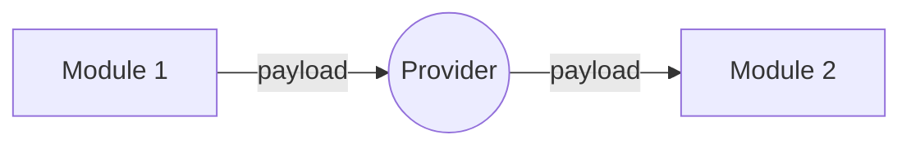
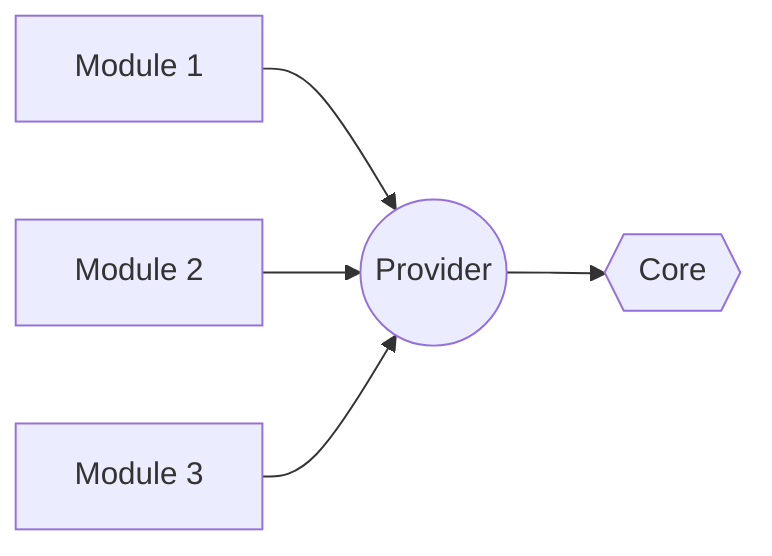

This readme comes with another languages :
- [English (EN)](README_EN.md)
- [Bahasa Indonesia (ID)](README.md)

# OOPS
Main feature is in cooking.

- [Modification Safe](https://github.com/stefanusayudha/base-android-compose/issues/40)
  This feature supposed to make you able to change the project name and modules name, yet still be able to get codebase update safely. And sorry about the deprecation of the version 1. I think i've made a mistake by the versioning and the package naming procedure, so i will continue work on the version 2 for now. I've changed the package name so it is more general as a codebase. This step is required to make the template builder i am currently working on.

Be sure to follow this project to get notification about project updates.

# THANK YOU
First i want to thank you and appreciate all the contributors of this project; [Contributors](CREDITS.md).

- **Joseph Sanjaya** (meet: [joseph](https://github.com/JosephSanjaya)).
 The original Idea of the navigation's concept and terminology of this codebase.

# FREE TO USE
You can use this codebase as your project base and modify this codebase for your project purpose. I create this codebase so hopefully it can helps anybody to start their project, especially a big scaled project. I thank you for anybody that is using this codebase as their project base, since by using this project, you are contributing by helping me testing this codebase. I hope by more user using this codebase, will give me input feedback or advice to help me improve this codebase. To make this codebase better and robust. I will also be pleased to receive your advice, idea or contribution for this project.

# Welcome to My Codebase Design!
To measure something we need a base line and a measurement tool, so for a codebase. The base line is **Dependency Flow** and **Runtime Flow**, and the measurement tools are **Software Development Principles**. How robust is it by how many **Software Development Principles** applied to it. Other than that are preferences.

Here we will "**Back to Basic**" by focus in **Dependency Flow** and **Runtime Flow**.

I have a simple principle; "If it's hard, than it's wrong". So we will make it easier my introducing new modules in the gradle project called **Provider** and **Igniter**.

Main ideas of this project are:
1. Completely remove Horizontal dependency by providing new modules called **Provider** and **Igniter**.
2. Remove states in Data Layers by optimizing functional pattern's approach in Data Layers.
3. Localize side effects. We have to limit modules that can do side effect and if possible completely remove it.

# Project's Architecture
The project's architecture covers all our gradle project's modules. Not everything we can do with the gradle but having exceptions is bad if we are not setting a limit to it. So we will allow for only two exceptions in this module's architecture.
1. App Module is part of Igniter module. So it can behaves like Igniter module, but it can't provides any modules just like the Igniter module.
 for example; Igniter module, inject all runtime modules to Application class, mean while App module inject or declare Activity to the manifest file.
2. Straight dependency to the Core Module. Because of core module's components are used to be small in sizes and so many. It will be to hard to Inversely inject it. So we will just depend to it straightly **through the Provider Module**.
 

**Circular Dependency** happens mainly because we allow horizontal dependency. So in this architecture design, we won't allow any horizontal dependency.
1. A module cannot depend to another module except the Provider module.
2. A module, should not knowing the existence of another Modules except the Provider module.

## Provider
As how it is called a "Provider module", it means to provide modules according to the contract that has been declared in the Provider Module. The modules it provides can be **APIs**, **Activities**, **Widgets** and else.

### Runtime Flow

Any module can depend to another module by the contract that has already declare in the Provider Module. Of course the module it self should first be registered by the **Igniter Module**.

### Dependency Flow

All modules that is categorized as Runtime Modules can only depend to Provider Module. Also the **Provider Module** is the only module that is directly depends to the **Core Module**. So every module that depends to the **Provider Module** can access the **Core Module** via the **Provider Module**.
This straight dependency of the **Provider Module** to the **Core Module** is an exception to the Dependency Inversion principle. Since Core Module's components are used to be so many and smalls, it will be easier to directly depends to them rather than inversely injecting them.

## Igniter
Igniter is a fuse or a wick. This module responsible to inject all module to the Application class, to tie everything together. That is why this module should depends to everything and then put everything together, injects them to the Application class.

**Application** should be provided by the Igniter, and the Igniter shall inject everything together into a wick in the Application class.

## Architecture Overview
For architecture overview see: [arsitektur-overview.pdf](arsitektur-overview.pdf) file.

# Internal Module Arsitektur
We have MVVM, Clean Architecture, and SOLID but should and app be that much complicated? As a front end developer, i never seen such a very complicated case that i think is worth the effort.

Front-end application only consist of 2 things, there are **UI** and **Data**.

## UI
UI is a high level module, no doubt. It is full with side-effects, lifecycles, configuration changes and else. This module is indeed complicated. So for this one SOLID principle and Dependency Injection will so much helping. Nothing special that i want to say but **ONE THING**:
> # THINK STATELESS
Make everything state less if possible. Never make something that have active internal state in it.

**Note**: Even though UI is full with side effects, we cannot just believe it. But if possible we have to remove it completely. For example; in imperative android's programming, i used to allow side effects happens only inside the Controller Class (Fragment or Activity).
1. It cannot have side effects anywhere else but inside the controller class. 
 Even though viewmodel and adapter are also UI's module but since they are not consider a controller class, they should not be allowed to have side effects.
2. Class with side effects cannot doing "**Cross Responsibility Side Effect**"
 For example, if there is a fragment that implements the contract A and B. The overriden functions of each contract cannot sharing side effects.
 If for some reason the overriden function of the contract A should save some value in a global variable, the overrided methods of the contract B should never touch this variable, otherwise it will consider a **Cross Responsibility Side Effect**. If the overriden function of the contract B need the value from the contract A associated instance's function, the contract A should provides the value in some way and obey the Dependency Inversion Principle.

## Data
Here is where the interesting happens. Data layer don't need side effect, it cares not to the lifecycle and configuration changes such like rotation, theme changing and else. This module is so simple, so why won't we make it simpler?

In this project example, Data Modules are not obeying the SOLID principles. But we will maximize the **Functional Pattern** approach as far as possible. I still found some difficulties applying Kotlin Arrow library for now but it's still obey the basic of the Functional Pattern. I do need your help on this.
1. Data Module should not have states. It should only concern about what data is requested and deliver it or give an error by Throwable or Either - Left , which ever you want.
2. Data Module's job is only to provides data from the data source. How the data source would behave is not the concern of the Data Module.
3. Methods or Interfaces in Data Module must be Pure Functions or Suspended Pure Functions.
4. Since they no longer have states, rather than using dependency inversion we will use monoid chain instead, it is way more simpler.

## There is no Domain Layers
For the professionals, this might be consider a taboo. But i do in purpose as an experiment, since this approach is one of the purpose why i built this code base. But don't be worried, feel free to do what you want.

I removed the domain layers by purpose to maximize the **Pure Function** approach in the Data Layers.

Pure Function Approach:
1. Every functions in Data Layer should be **Pure Functions** or **Suspended Pure Functions**.
2. Pure Function should obey these criteria:
>1. Same output for the same input.
>2. No side effects.
>3. No states.
>4. Function duty is only change an input into an output. For example; an Integer into a String, or a Payload into a Data, or Error if the process cannot be fulfilled.
3. This approach requires the same output for the same given input, means that if we expect a different output, we should provide different input. Example case; if there is changes in the business logic; In the simple way, for every different business logic we shall provides different payload. Or in another way, we don't have such concept "a business process change", rather we consider it as "a new business process".
 We don't change the business process, but we scale the business process by providing new Pure Function and new Payload for every new business process.

# Contributing
I would love to have contributors, and i do open this project for contributor. But for now i still making the procedure's files like Gitflow and else, so if you are interesting to make contribution, you can DM me. You can find me at the Author section bellow.

You can see the project progress [here](https://github.com/users/stefanusayudha/projects/2).

# Meet the Author
I'm steve, a programmer for fun. You can find me at these links bellow:

1. [Instagram @stefanus_ayudha](https://www.instagram.com/stefanus_ayudha/)
2. [Telegram @stefanus_ayudha](https://t.me/stefanus_ayudha)
3. [Email @stefanus.ayudha](mailto:stefanus.ayudha@gmail.com)
4. [Linkedin @stefanus_ayudha](https://www.linkedin.com/in/stefanus-ayudha-447a98b5/)
